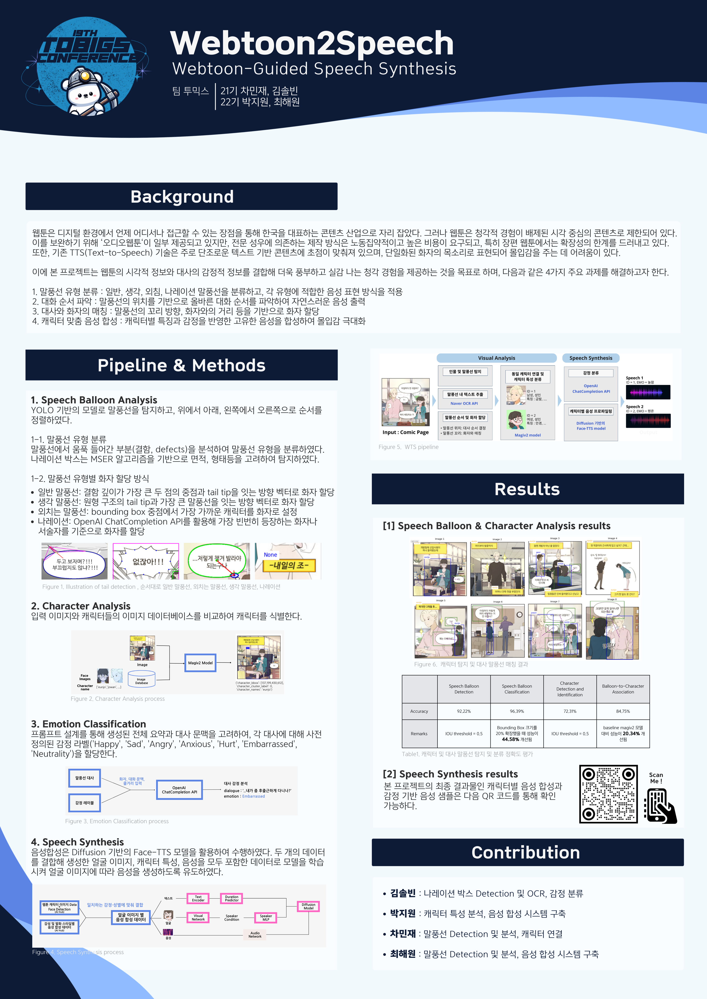

# Webtoon-To-Speech
시각 및 감정적 요소를 반영한 웹툰 음성 변환  
📅 2024.09 ~ 2025.01  
📌 Speech Synthesis와 관련하여 논문 작성이 예정 중에 있습니다 📌  
📌 코드 정리 완료 후후 업로드 예정입니다 📌
  
## 📖 Overview
- 현재 웹툰은 시각 중심의 콘텐츠로, 청각적 몰입이 부족함
- 성우 기반 오디오 웹툰은 높은 제작 비용으로 인해 대중적으로 활용하기 어려움
- 목표 : 웹툰의 **시각적 정보**와 대사의 **감정적 정보**를 결합해 더욱 풍부하고 실감 나는 청각 경험을 제공
---

## 🏗️ Pipeline

  

---

## 🔥 주요 도전 과제 및 해결 방법
| 과제 |  설명 |
|--------|---------|
| **말풍선 형태 분석** | 일반 대화, 감정 표현, 내레이션 등 다양한 말풍선 유형을 인식해야 함 |
| **대화 순서 결정** | 웹툰의 다양한 말풍선 배치 방식에 따라 적절한 순서로 출력해야 함 |
| **화자 할당 문제** | Tail tip(말풍선 꼬리 방향) 및 문맥을 고려한 화자 매칭 필요 |
| **감정 반영 음성 합성** | 캐릭터의 성별, 나이, 감정에 따라 적절한 음성 톤을 생성해야 함 |

### ✅ 형태 분석    
**💬일반 말풍선과 🗯️외침 말풍선**

- 가장 깊은 defect 영역의 segment를 밑변으로 한 삼각형 생성 후, 두 삼각형 사이 최단 거리의 중앙값을 tail tip으로 결정
- defect 포인트 한 쌍과 하나의 tip 포인트 ➡️ 일반 말풍선
- 여러 개의 defect와 tip 포인트 ➡️ 외침 말풍선
  
**💭생각 말풍선** 

- 원형 구조의 tail tip
- 뾰족한 tail tip이 없는 말풍선을 대상으로 원형 컨투어 탐지

**🗣️나레이션**

- 명확한 경계와 직사각형 또는 정사각형 형태
- MSER 알고리즘으로 후보 영역 탐지 후,  4가지 요소(크기, 형태, 위치, 강도)를 기준으로 필터링

 
  

### ✅ 대화 순서 결정
  - 위에서 아래,왼쪽에서 오른쪽 정렬
  
### ✅ 화자 할당
🛠️ Magiv2 model, OpenAI ChatCompletion API

Magiv2 모델을 활용하여 이미지 내 등장인물을 식별한 뒤 말풍선에 적절한 화자를 할당
- Input : 캐릭터 얼굴 crop 이미지, 캐릭터 이름 
- Output : 캐릭터 이름, Bounding box 좌표  

식별된 등장인물의 bounding box 좌표를 이용하여 말풍선 할당
- **일반 말풍선과 생각 말풍선** : 가장 가까운 화자를 먼저 바 API 사용) 

---
  
## 🔧 Trouble Shooting 
🤔 말풍선 분류 정확도 결과가 매우 낮음  
💡 **말풍선 탐지 바운딩 박스 20% 확장**  
말풍선이 탐지된 바운딩 박스 크기로 이미지를 잘라서 말풍선의 종류를 분석하는 것이 로직이었습니다.
이 과정에서 말풍선 전체가 바운딩 박스에 들어오지 않게 되면서 말풍선 분류 정확도가 낮게 나타났습니다. 이를 해결하기 위해 말풍선의 detected bounding box 크기를 20% 확장했습니다.

🤔 말풍선과 화자 연결이 제대로 이우어지지 않은 경우가 나타남  
💡 말풍선과 화자 간 **각도를 고려**해서 연결  
화자가 컷 안에 존재하지 않는 경우 또는 말풍선 연결이 실제 화자와 일치하지 않는 경우가 나타났습니다. 이를 해결하기 위해 말풍선 중심점과 캐릭터의 중심점을 이은 선, 말풍선 중심점과 말풍선 tail tip을 이은 선 사이의 각도를 측정했습니다. 
 1. 각도가 120도를 넘어가면 화자가 현재 컷 안에 없다고 간주하여 화자를 할당하지 않았고
 2. 컷 안에 있지만 제대로 매칭되지 않는 경우, 가장 작은 각도를 가지는 화자와 연결되도록 했습니다.
